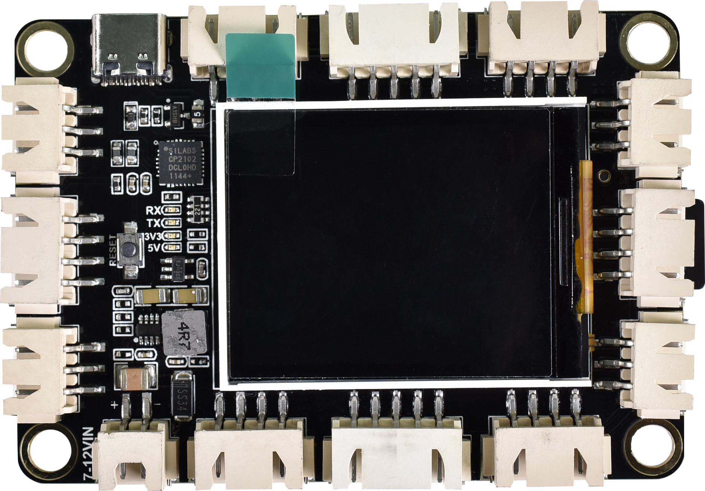
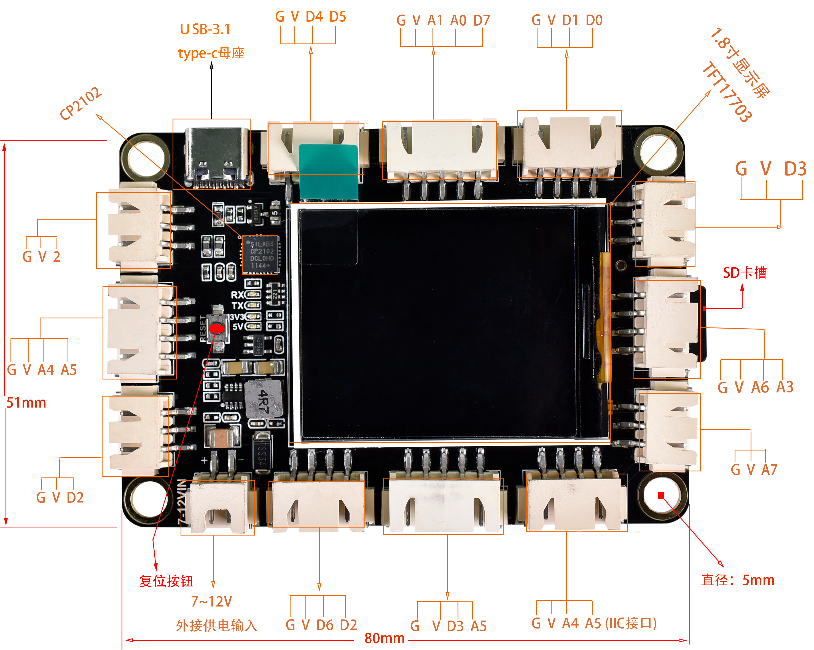
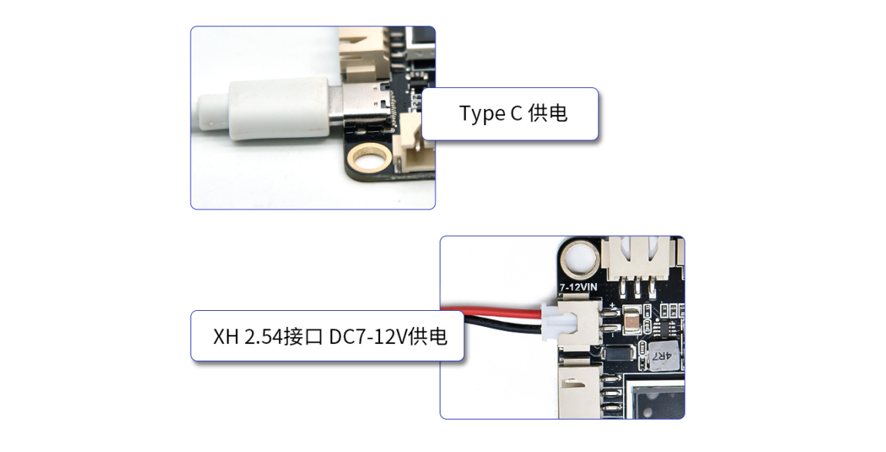
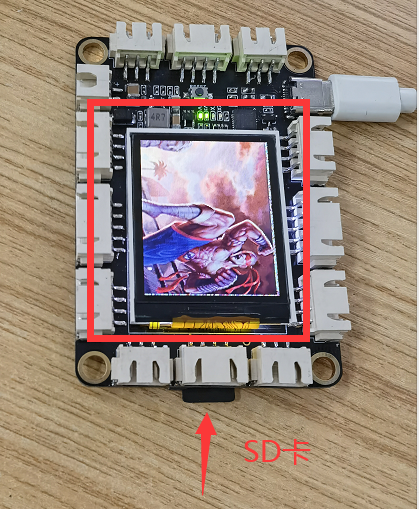

# KE0175 Keyes STEM 电子积木编程教育开发板



---

## 资料下载

[资料](./资料.7z)

## 1. 简介

KE0175 Keyes STEM 电子积木编程教育开发板是一款基于 ATmega328P 的单片机开发板，完全兼容 Arduino IDE 开发环境。该开发板集成了一块 1.8 寸 TFT 屏和 SD 卡模块，便于显示实验内容和储存数据。可搭配丰富的 XH2.5 接口扩展使用，外围传感器即插即用，开发板上有四个螺丝定位孔，可搭配电子积木，完成简单的造型和创意性的实验。

---

## 2. 特点
- **兼容性强**：完全兼容 Arduino IDE 开发环境，易于上手。
- **集成显示**：内置 1.8 寸 TFT 屏，方便实时显示数据和信息。
- **扩展性好**：支持 XH2.5 接口，外围传感器即插即用。
- **环保设计**：采用环保材料，安全可靠。
- **多功能**：适合教育、DIY 项目和创意实验。

---

## 3. 规格参数
- **USB 输入电压**：DC 3.3V - 5V  
- **VIN 输入电压**：DC 7~12V  
- **IO 输出电流**：80mA  
- **VCC 输出最大电流**：3A  
- **最大功率**：15W  
- **工作温度范围**：-10~50℃  
- **微控制器**：ATmega328P-AU  
- **USB 转串口芯片**：CP2102  
- **数字 I/O 引脚**：8 (D0-D7)  
- **PWM 通道**：3 (D3、D5、D6)  
- **模拟输入通道（ADC）**：8 (A0-A7)  
- **Flash Memory**：32 KB（其中引导程序使用 0.5 KB）  
- **SRAM**：2 KB (ATmega328P-AU)  
- **EEPROM**：1 KB (ATmega328P-AU)  
- **时钟速度**：16MHz  
---

## 4. 接口
- **USB 接口**：用于供电和编程。
- **VIN 接口**：外部电源输入。
- **数字 I/O 引脚**：用于连接传感器和执行器。
- **PWM 接口**：用于脉宽调制输出。
- **模拟输入引脚**：用于读取模拟信号。
- **SD 卡模块**：用于存储数据和文件。



---

## 5. 连接图



**引脚定义**

- **VCC**：连接到 Arduino 的 5V 引脚。
- **GND**：连接到 Arduino 的 GND 引脚。
- **DATA**：连接到 Arduino 的数字引脚（如 D2）。

---

## 6. 示例代码
以下是一个简单的示例代码，用于读取 SD 卡中的 BMP 图片并在 TFT 屏上显示，同时进行电压测试和流水灯测试：

注意：

1、请先将开头下载的资料里面的图片复制到SD卡根目录，并且SD卡需要时FAT32格式；

2、上传代码时请使用开头下载的资料里面的代码，里面包含了库文件，直接复制下面代码没有库文件会报错。

```cpp
/***************************************************
  This is an example sketch for the Adafruit 1.8" TFT shield with joystick
  ----> http://www.adafruit.com/products/802

  Check out the links above for our tutorials and wiring diagrams
  These displays use SPI to communicate, 4 pins are required to
  interface
  One pin is also needed for the joystick, we use analog 3
  Adafruit invests time and resources providing this open source code,
  please support Adafruit and open-source hardware by purchasing
  products from Adafruit!

  Written by Limor Fried/Ladyada for Adafruit Industries.
  MIT license, all text above must be included in any redistribution
 ****************************************************/

#include "Adafruit_GFX.h"
#include "Adafruit_ST7735.h"
#include <SD.h>
#include <SPI.h>

#if defined(__SAM3X8E__)
    #undef __FlashStringHelper::F(string_literal)
    #define F(string_literal) string_literal
#endif

// TFT display and SD card will share the hardware SPI interface.
// Hardware SPI pins are specific to the Arduino board type and
// cannot be remapped to alternate pins.  For Arduino Uno,
// Duemilanove, etc., pin 11 = MOSI, pin 12 = MISO, pin 13 = SCK.
#define SD_CS    7  // Chip select line for SD card
#define TFT_CS  8  // Chip select line for TFT display
#define TFT_DC   10  // Data/command line for TFT
#define TFT_RST  9  // Reset line for TFT (or connect to +5V)

Adafruit_ST7735 tft = Adafruit_ST7735(TFT_CS, TFT_DC, TFT_RST);

int Delay_Timer = 300;

void setup(void) {
  Serial.begin(9600);
  Pin_Set();
  // Initialize 1.8" TFT
  //tft.initR(INITR_BLACKTAB);   // initialize a ST7735S chip, black tab
  tft.initR();
  
  Serial.println("OK!");
  tft.fillScreen(ST7735_BLACK);
  tft.setRotation(45);
  tft.setTextSize(2);
  Serial.print("Initializing SD card...");
  if (!SD.begin(SD_CS))
  {
    Serial.println("failed!");
    tft.setTextColor(ST7735_RED);
    tft.setCursor(30, 40);
    tft.print("SD Error");
    return;
   }
   else
   {
      Serial.println("SD OK");
      tft.setTextColor(ST7735_RED);
      tft.setCursor(30, 40);
      
      tft.print("SD OK");
   }
  delay(500);
}

void loop() 
{ 
  Voltage_Test();   //A6/A7测试5V电压
  delay(3000);
  Pin_Test();  //流水灯测试
  delay(1000);
  
  Bmp();            //SD卡读取图片测试
  //while (1);
}

void Voltage_Test()
{
  tft.setTextSize(1);
  String A6_Value = String(analogRead(A6) *5.0 / 1023 * 2.0);
  String A7_Value = String(analogRead(A7) *5.0 / 1023 * 2.0);
  Serial.println(String("A6_Value:") + A6_Value + " V");
  Serial.println(String("A7_Value:") + A7_Value + " V");
  tft.setTextColor(ST7735_BLACK);
  tft.setCursor(10, 80);
  tft.print(String("A6_Value:") + A6_Value + " V");
  tft.setCursor(10, 100);
  tft.print(String("A7_Value:") + A7_Value + " V");
  delay(250);
  tft.setTextColor(ST7735_WHITE);
  tft.setCursor(10, 80);
  tft.print(String("A6_Value:") + A6_Value + " V");
  tft.setCursor(10, 100);
  tft.print(String("A7_Value:") + A7_Value + " V");
}

void Bmp()
{
  bmpDraw("car.bmp", 0, 0);
  delay(Delay_Timer);
  bmpDraw("avatar.bmp", 0, 0);
  delay(Delay_Timer);
//  bmpDraw("DEMA.bmp", 0, 0);
//  delay(Delay_Timer);
//  bmpDraw("DLAM.bmp", 0, 0);
//  delay(Delay_Timer);
//  bmpDraw("mangseng.bmp", 0, 0);
//  delay(Delay_Timer);
//  bmpDraw("TLP.bmp", 0, 0);
//  delay(Delay_Timer);
//  bmpDraw("girl.bmp", 0, 0);
//  delay(Delay_Timer);
}

void Pin_Test()
{
  digitalWrite(0,LOW);
  delay(Delay_Timer);
  digitalWrite(0,HIGH);
  digitalWrite(1,LOW);
  delay(Delay_Timer);
  digitalWrite(1,HIGH);
  digitalWrite(2,LOW);
  delay(Delay_Timer);
  digitalWrite(2,HIGH);
  digitalWrite(3,LOW);
  delay(Delay_Timer);
  digitalWrite(3,HIGH);
  digitalWrite(4,LOW);
  delay(Delay_Timer);
  digitalWrite(4,HIGH);
  digitalWrite(5,LOW);
  delay(Delay_Timer);
  digitalWrite(5,HIGH);
  digitalWrite(6,LOW);
  delay(Delay_Timer);
  digitalWrite(6,HIGH);
  digitalWrite(7,LOW);
  delay(Delay_Timer);
  digitalWrite(7,HIGH);

  digitalWrite(A0,LOW);
  delay(Delay_Timer);
  digitalWrite(A0,HIGH);
  digitalWrite(A1,LOW);
  delay(Delay_Timer);
  digitalWrite(A1,HIGH);
  digitalWrite(A2,LOW);
  delay(Delay_Timer);
  digitalWrite(A2,HIGH);
  digitalWrite(A3,LOW);
  delay(Delay_Timer);
  digitalWrite(A3,HIGH);
  digitalWrite(A4,LOW);
  delay(Delay_Timer);
  digitalWrite(A4,HIGH);
  digitalWrite(A5,LOW);
  delay(Delay_Timer);
  digitalWrite(A5,HIGH);
}

void Pin_Set()
{
  for(int i = 0; i < 7; i++)
  {
    pinMode(i,OUTPUT);
  }
  for(int i = 14; i < 20; i++)
  {
    pinMode(i,OUTPUT);
  }

  for(int i = 0; i < 7; i++)
  {
    digitalWrite(i,HIGH);
  }
  for(int i = 14; i < 20; i++)
  {
    digitalWrite(i,HIGH);
  }
}

// This function opens a Windows Bitmap (BMP) file and
// displays it at the given coordinates.  It's sped up
// by reading many pixels worth of data at a time
// (rather than pixel by pixel).  Increasing the buffer
// size takes more of the Arduino's precious RAM but
// makes loading a little faster.  20 pixels seems a
// good balance.

#define BUFFPIXEL 20

void bmpDraw(char *filename, uint8_t x, uint8_t y) {

  File     bmpFile;
  int      bmpWidth, bmpHeight;   // W+H in pixels
  uint8_t  bmpDepth;              // Bit depth (currently must be 24)
  uint32_t bmpImageoffset;        // Start of image data in file
  uint32_t rowSize;               // Not always = bmpWidth; may have padding
  uint8_t  sdbuffer[3*BUFFPIXEL]; // pixel buffer (R+G+B per pixel)
  uint8_t  buffidx = sizeof(sdbuffer); // Current position in sdbuffer
  boolean  goodBmp = false;       // Set to true on valid header parse
  boolean  flip    = true;        // BMP is stored bottom-to-top
  int      w, h, row, col;
  uint8_t  r, g, b;
  uint32_t pos = 0, startTime = millis();

  if((x >= tft.width()) || (y >= tft.height())) return;

  Serial.println();
  Serial.print("Loading image '");
  Serial.print(filename);
  Serial.println('\'');

  // Open requested file on SD card
  if ((bmpFile = SD.open(filename)) == NULL) {
    Serial.print("File not found");
    return;
  }

  // Parse BMP header
  if(read16(bmpFile) == 0x4D42) { // BMP signature
    Serial.print("File size: "); Serial.println(read32(bmpFile));
    (void)read32(bmpFile); // Read & ignore creator bytes
    bmpImageoffset = read32(bmpFile); // Start of image data
    Serial.print("Image Offset: "); Serial.println(bmpImageoffset, DEC);
    // Read DIB header
    Serial.print("Header size: "); Serial.println(read32(bmpFile));
    bmpWidth  = read32(bmpFile);
    bmpHeight = read32(bmpFile);
    if(read16(bmpFile) == 1) { // # planes -- must be '1'
      bmpDepth = read16(bmpFile); // bits per pixel
      Serial.print("Bit Depth: "); Serial.println(bmpDepth);
      if((bmpDepth == 24) && (read32(bmpFile) == 0)) { // 0 = uncompressed

        goodBmp = true; // Supported BMP format -- proceed!
        Serial.print("Image size: ");
        Serial.print(bmpWidth);
        Serial.print('x');
        Serial.println(bmpHeight);

        // BMP rows are padded (if needed) to 4-byte boundary
        rowSize = (bmpWidth * 3 + 3) & ~3;

        // If bmpHeight is negative, image is in top-down order.
        // This is not canon but has been observed in the wild.
        if(bmpHeight < 0) {
          bmpHeight = -bmpHeight;
          flip      = false;
        }

        // Crop area to be loaded
        w = bmpWidth;
        h = bmpHeight;
        if((x+w-1) >= tft.width())  w = tft.width()  - x;
        if((y+h-1) >= tft.height()) h = tft.height() - y;

        // Set TFT address window to clipped image bounds
        tft.startWrite();
        tft.setAddrWindow(x, y, w, h);

        for (row=0; row<h; row++) { // For each scanline...

          // Seek to start of scan line.  It might seem labor-
          // intensive to be doing this on every line, but this
          // method covers a lot of gritty details like cropping
          // and scanline padding.  Also, the seek only takes
          // place if the file position actually needs to change
          // (avoids a lot of cluster math in SD library).
          if(flip) // Bitmap is stored bottom-to-top order (normal BMP)
            pos = bmpImageoffset + (bmpHeight - 1 - row) * rowSize;
          else     // Bitmap is stored top-to-bottom
            pos = bmpImageoffset + row * rowSize;
          if(bmpFile.position() != pos) { // Need seek?
            tft.endWrite();
            bmpFile.seek(pos);
            buffidx = sizeof(sdbuffer); // Force buffer reload
          }

          for (col=0; col<w; col++) { // For each pixel...
            // Time to read more pixel data?
            if (buffidx >= sizeof(sdbuffer)) { // Indeed
              bmpFile.read(sdbuffer, sizeof(sdbuffer));
              buffidx = 0; // Set index to beginning
              tft.startWrite();
            }

            // Convert pixel from BMP to TFT format, push to display
            b = sdbuffer[buffidx++];
            g = sdbuffer[buffidx++];
            r = sdbuffer[buffidx++];
            tft.pushColor(tft.color565(r,g,b));
          } // end pixel
        } // end scanline
        tft.endWrite();
        Serial.print("Loaded in ");
        Serial.print(millis() - startTime);
        Serial.println(" ms");
      } // end goodBmp
    }
  }

  bmpFile.close();
  if(!goodBmp) Serial.println("BMP format not recognized.");
}

// These read 16- and 32-bit types from the SD card file.
// BMP data is stored little-endian, Arduino is little-endian too.
// May need to reverse subscript order if porting elsewhere.

uint16_t read16(File f) {
  uint16_t result;
  ((uint8_t *)&result)[0] = f.read(); // LSB
  ((uint8_t *)&result)[1] = f.read(); // MSB
  return result;
}

uint32_t read32(File f) {
  uint32_t result;
  ((uint8_t *)&result)[0] = f.read(); // LSB
  ((uint8_t *)&result)[1] = f.read();
  ((uint8_t *)&result)[2] = f.read();
  ((uint8_t *)&result)[3] = f.read(); // MSB
  return result;
}

```

---

## 7. 实验现象
上传程序后，开发板将读取 SD 卡中的图片并在 TFT 屏上显示内容。如果 SD 卡插入正确且文件存在，屏幕将显示文件内容；如果出现错误，屏幕将显示相应的错误信息。同时，电压测试结果将显示在屏幕上，流水灯测试将依次点亮数字引脚。



---

## 8. 注意事项
- 确保 SD 卡中存在指定的 BMP 文件（如 `car.bmp` 和 `avatar.bmp`）。

- 确保供电电压在 7-12V 范围内，避免损坏开发板。

- 在上传代码之前，确保选择正确的板和 COM 口。

- 使用合适的库文件以确保程序正常运行。

  

如有更多疑问，请联系 Keyes 官方客服或加入相关创客社区交流。祝使用愉快！